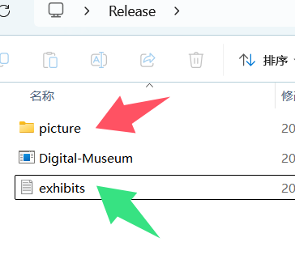

# Digital-Museum
基于C++和C++ windows api的简易数字信息博物馆，包含展示、写入、记忆存储功能.
其中展示功能的展示图片通过调用windows系统的api实现，写入和记忆化存储功能通过文件写入和读取操作.
[release]([Releases · Moeus/Digital-Museum](https://github.com/Moeus/Digital-Museum/releases))中的文件为zip格式，因为除了exe程序外还有一些必备文件，所以打成压缩包

## 关于写入
写入时按照程序提示写入信息
其中图片需要输入图片在系统内的路径
然后按照提示退出程序，即可完成记忆化写入

上方图片中红色箭头指向的是初始的存储图片的文件夹，这个文件夹的名字最好不更改
如果你将展品的图片放入该文件夹中，那写入信息时，展品的文件路径可以写为`“picture/图片名称.图片格式”` 
图片格式推荐windows本地图片查看器可打开的格式

图片中绿色箭头指向的文件为记忆化写入时写入的文件
**该文件不能修改文件名**，不能修改文件内容，否则存储的数据丢失

---

由于编程过程中懒得切换输入法，所以这个版本的内容还是英文